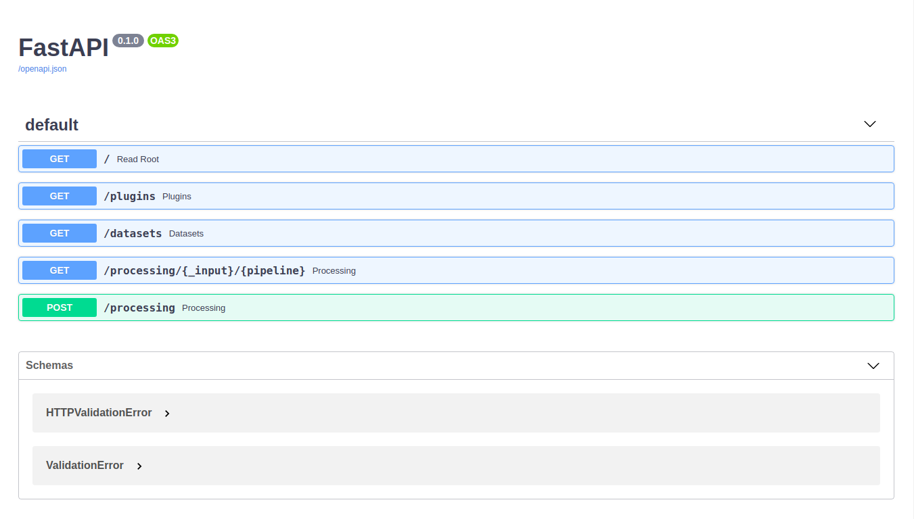
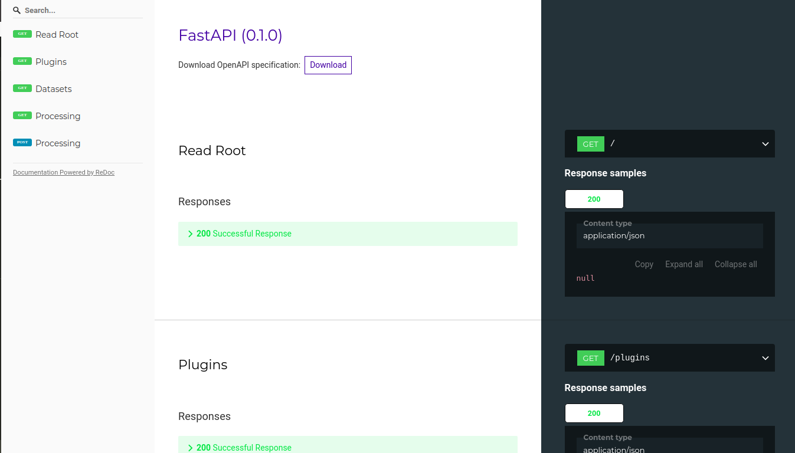

DeepNLPF has a HTTP RESTful that allows you to use its services through POS, GET, PUT and DELETE requests. This makes it possible for applications running on low performance computers to take advantage of this technology, leaving the processing overhead to the server.

## Start Service
To run the API, you must have DeePNLPF installed. The following command is required to start the service.
<!--DOCUSAURUS_CODE_TABS-->

<!--Shell-->
```shell
deepnlpf --api start
```

<!--Result-->
```shell
INFO:     Uvicorn running on http://127.0.0.1:8000 (Press CTRL+C to quit)
INFO:     Started reloader process [626042] using statreload
INFO:     Started server process [626052]
INFO:     Waiting for application startup.
INFO:     Application startup complete.
```

<!--END_DOCUSAURUS_CODE_TABS-->

## Docs
By accessing the address: [```http://127.0.0.1:8000/```](http://127.0.0.1:8000/) you will see a screen like this informing you that the API has been successfully started and is ready to use.
```json
{
  "DeepNLPF": "Welcome API RESTFul",
  "Version": "0.0.14",
  "Docs": "http://127.0.0.1:8000/docs",
  "ReDoc": "http://127.0.0.1:8000/redoc"
}
```

## ReDocs
Accessing the address [```http://127.0.0.1:8000/docs```](http://127.0.0.1:8000/docs) you will get the API docs return.



Accessing the address [```http://127.0.0.1:8000/redoc```](http://127.0.0.1:8000/redoc) you will get the API Redoc return.



## Stop Service

    Press CTRL+C to quit

## Created with

</a>
    <a href="https://fastapi.tiangolo.com/" target="_blank" title="FastAPI">
    
</a>
