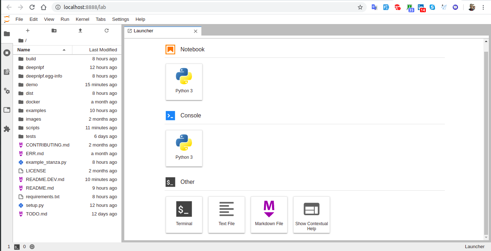
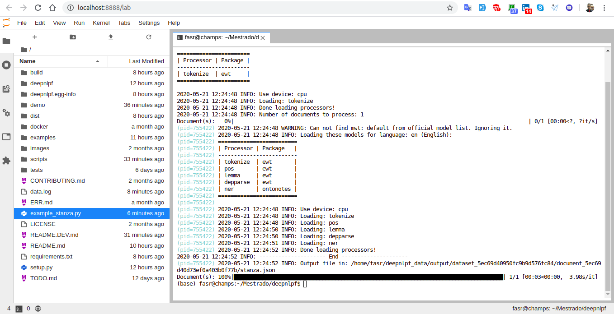

Use DeepNLPF with Jupyter Lab.

## Installing from Source

```shell
git clone https://github.com/deepnlpf/deepnlpf.git
```

```shell
cd deepnlpf
```

```shell
virtualenv .venv
```

```shell
source .venv/bin/activate
```

```shell
pip install -r requirements.txt
```


## Install Jupyter Lab
- [JupyterLab Documentation](https://jupyterlab.readthedocs.io/en/latest/index.html)
```shell
pip install jupyterlab
```

Run Jupyter Lab
```shell
jupyter lab
```



## Run Examples

Jupyter >> Painel Launcher >> Other >> Terminal

Execute command:
```shell
python example_stanza.py
```



More example view in directory examples.