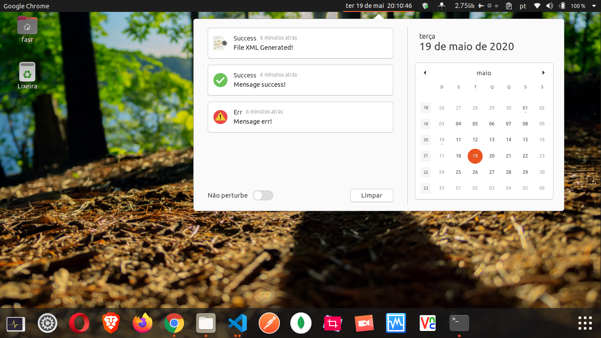
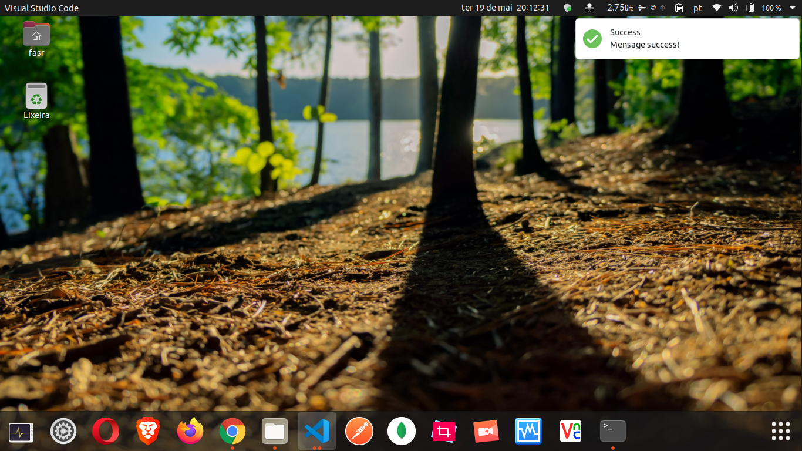

DeepNLPF can notify you of the processing logs in a more interactive and friendly way. We've separated some notification options for you.

## Toast
Toast notification example 01.


Toast notification example 02.


Activate notification toast.
```shell
deepnlpf --settoast true
```

Deactivate notification toast.
```shell
deepnlpf --settoast false
```

## Telegram
* [Telegram](https://web.telegram.org/) - Notification Device Mobile.
>  🚧 Comming Soon :)

## Email
>  🚧 Comming Soon :)

## Spech
> 🚧 Comming Soon :)


