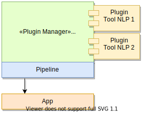
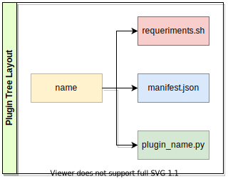

A plugin is a software component that adds a specific feature to an existing computer program. When a program supports plug-ins, it allows customization.

There are many benefits to building apps with a plugin framework:

- 3rd party developers can create and extend upon your app.
- New features are easier to developer.
- Your application becomes smaller and easier to understand.

If you don't understand anything about a plugin, read this article quickly: [Plug-in Architecture](https://medium.com/omarelgabrys-blog/plug-in-architecture-dec207291800).

## Architecture Plugin

The DeepNLPF can run registered plugins. Sweating architecture works as follows:



Your application is linked to a pipeline manager that is connected to the Plugin Manager component, this is our focus. This module is responsible for installing and removing plugins, loading the plugins, collecting information about the plugins, name, features, input, processing and output of the data in the plugin.

## Structure Plugin

For you to create your own plugin and add it to DeepNLPF, you must pay attention to the structure that should compose a DeepNLPF plugin.



As you may have already noticed in the figure, a plugin is built following a file structure: ```directory like the name of the plugin```, ```requirements.sh``` file, ```manifest.json``` file and the ```plugin_name.py``` file.


You can also add other files and directories as needed, things like: ```README.md```, ```LICENSE```, ```bin```, ```resources```, among others. This is just the basic structure to be followed, which you can customize according to your needs, as long as it does not violate the mandatory recommendations.

### Directory Plugin Name

For you to build a plugin, you must have a directory with the name of the plugin you want. For example: ```stanza```. Avoid putting special characters, spacing, among others, in the directory name, make things clean and simple.

### File requeriments.sh

The use of this file is optional, you should only use it if the tool you want to add requires installation of dependencies and settings.

Example: ```requirements.sh```
```shell
sudo apt install [tool]
pip install [name_tool]
wget [url]
rm - r [file|directory]
...
```

### File manifest.json
Every plugin must contain this metadata file. Through it, [DeepNLPF DashBoard](https://:deepnlpf.github.io/site/docs/en/dashboard) has relevant information about the plugins added, thus, DeepNLPF DashBoard will know which linguistic analyzes, functionalities are being provided by the configured plugin.

Examples: 
<!--DOCUSAURUS_CODE_TABS-->

<!--Tool NLP manifest.json--> 
```json
{
    "manifest_version": "1",
    "name": "Stanford CoreNLP",
    "version": "3.9.2",
    "keyname": "stanfordcorenlp",
    "description": "Stanford CoreNLP provides a set of human language technology tools. It can give the base forms of words, their parts of speech, whether they are names of companies, people, etc., normalize dates, times, and numeric quantities, mark up the structure of sentences in terms of phrases and syntactic dependencies, indicate which noun phrases refer to the same entities, indicate sentiment, extract particular or open-class relations between entity mentions, get the quotes people said, etc.",
    "site": "https://stanfordnlp.github.io/",
    "author": "RodriguesFAS",
    "category": "pln",
    "license": "MIT",
    "is_activated": true,
    "analysis": [{
            "lexical": [{
                    "name": "Tokenize Annotator",
                    "keyname": "tokenize",
                    "description": "https://nlp.stanford.edu/software/tokenizer.shtml"
                },
                {
                    "name": "Sentence Split",
                    "keyname": "ssplit",
                    "description": "https://nlp.stanford.edu/software/ssplit.shtml"
                },
                {
                    "name": "Part of Spesch (POS)",
                    "keyname": "pos",
                    "description": ""
                },
                {
                    "name": "Lemma Annotator",
                    "keyname": "lemma",
                    "description": ""
                },
                {
                    "name": "Named Entity Recognizer (NER)",
                    "keyname": "ner",
                    "description": ""
                },
                {
                    "name": "True Case Annotator",
                    "keyname": "truecase",
                    "description": ""
                }
            ]
        },
        {
            "syntatic": [{
                    "name": "Parse Annotator",
                    "keyname": "parse",
                    "description": ""
                },
                {
                    "name": "Dependency Parse Annotator",
                    "keyname": "depparse",
                    "description": ""
                }
            ]
        },
        {
            "semantic": []
        }
    ]
}
```

<!--DB manifest.json-->
```json
{
    "manifest_version": "1",
    "name": "MongoDB",
    "version": "",
    "keyname": "mongodb",
    "description": "MongoDB is a general purpose, document-based, distributed database built for modern application developers and for the cloud era. ",
    "site": "https://www.mongodb.com/",
    "author": "RodriguesFAS",
    "category": "db",
    "license": "",
    "operations": [{
            "name": "Save",
            "keyname": "save",
            "description": ""
        },
        {
            "name": "Select One",
            "keyname": "select_one",
            "description": ""
        },
        {
            "name": "Select",
            "keyname": "select",
            "description": ""
        },
        {
            "name": "Delete",
            "keyname": "delete",
            "description": ""
        }
    ]
}
```

<!--END_DOCUSAURUS_CODE_TABS-->

### File plugin_name.py

It is in the plugin_name.py file that you write all the logic of the new NLP tool that will be added. this file must be renamed, with the prefix ```plugin_``` followed by the name of the tool, which must be the same name given to the root directory of the plugin. For example:

```text
\ stanza
    requirements.sh
    manifest.json
    plugin_stanza.py
```

#### Create Class Plugin

The file ```plugin_name.py``` must be written following the pattern proposed by the interface``` IPlugin```. It is mandatory to implement its ``` __init __ () ```, ```run ()``` , ```wrapper ()``` and ```out_format ()``` methods to build a new plugin. Basically you are building a wrapper to access the NLP tool you want to add to the DeepNLPF. Therefore, ```plugin_name.py``` is a class that must be called ```Plugin``` and implement ```IPlugin```.

```python
# import interface.
from deepnlpf.core.iplugin import IPlugin

# Create a class with the name Plugin that implements the IPlugin interface and its mandatory methods.
class Plugin(IPlugin):

...
```


#### Function __init__()

When the Plugin class is instantiated, the ```__init__ ()``` method is executed. It is important to be aware of the method parameters ```__init__(self, id_pool, lang, document, pipeline)```. ```id_pool``` is used to reference in the database which processing pool this analysis was performed; ```lang``` which language is selected, as there are tools that work with languages other than English; ```document``` the document to be processed and finally ```pipeline``` contains the analyzes to be performed by the NLP tool. Don't worry, you can receive another extra parameter in this method if you need to add.

```python
def __init__(self, id_pool, lang, document, pipeline):
    # add variables, loads, path, other..
    self._id_pool = id_pool
    self._lang = lang
    self._document = document
    self._pipeline = pipeline
```

#### Function run()
In the ```run()``` method you must add only the start of the ```wrapper()```. Eveite leaving the functions very long and doing many different things.

```python
# method that runs the wrapper.
def run(self):
    # logic start wrapped ...
    doc_annotation = self.wrapper()
    return self.out_format(doc_annotation)
```

#### Function wrapper()
Here you add your logic on how to access the functionality of the tool that will be added. Don't worry if the NLP tool that will be added was built in another programming language, python achieves interoperability with almost all programming languages. We are also concerned with this, and we are constantly adding methods to support this.

```python
# here you add your logic on how to access the functionality of the tool that will be added.
def wrapper(self):
    # logic access tool nlp ...        
    return doc_annotation
```

#### Function out_format
This method is used to format the output processed by the NLP tool. In case the tool you are adding to the output is not ```JSON```, you must in this function make the conversion to this format and add it in the proposed scheme.

```python
def out_format(self, doc):
    # logic format output ...
    return doc_formated
```

Pay attention to the data output of the tool, it must obey the structure, to be valid.
```json
[ // list objects sentences.
    {
        "_id": 1, // id sentence.
        "text": "The boy gave the frog to the girl.", // sentence.
        "annotation": [..] // array list annotation sentence.
    },
    {
        "_id": 2,
        "text": "The boy's gift was to the girl.",
        "annotation": [..]
    },
    {
        "_id": 3,
        "text": "The girl was given a frog.",
        "annotation": [..]
    },

    ...
]
```

#### Example Full

<!--DOCUSAURUS_CODE_TABS-->

<!--Template file plugin_name.py--> 
```python
# import interface.
from deepnlpf.core.iplugin import IPlugin

# Create a class with the name Plugin that implements the IPlugin interface and its mandatory methods.
class Plugin(IPlugin):
    
    def __init__(self, document, pipeline):
        # add variables, loads, path, other..
        self._document = document
        self._processors = pipeline["tools"]["tool_name"]["processors"]
        self._lang = pipeline["lang"]
    
    # method that runs the wrapper.
    def run(self):
        # logic start wrapped ...
        annotation = self.wrapper()
        return self.out_format(annotation)

    # here you add your logic on how to access the functionality of the tool that will be added.
    def wrapper(self):
        # logic access tool nlp ...        
        return annotation

    # here you add your logic of how the data output will be formatted.
    def out_format(self, doc):
        # logic output ...
        return doc_formated

```
<!--Example Plugin Stanza-->
```python
#!/usr/bin/env python
# -*- coding: utf-8 -*-

import json
import stanza

from deepnlpf.core.iplugin import IPlugin


class Plugin(IPlugin):
    def __init__(self, document, pipeline):
        self._document = document
        self._processors = pipeline["tools"]["stanza"]["processors"]
        self._lang = pipeline["lang"]

    def run(self):
        doc = self.wrapper()
        doc_annotation = self.out_format(doc)
        return doc_annotation

    def wrapper(self) -> list:
        nlp = stanza.Pipeline(
            lang=self._lang, processors=", ".join(self._processors), use_gpu=False,
        )

        object_stanza = nlp(" ".join(self._document))

        return json.loads(str(object_stanza))  # convert object stanza to object json.

    def out_format(self, doc: list) -> list:
        doc_formated = list()

        for index, sentence in enumerate(doc):
            text = list()
            token_annotation = list()

            for token in sentence:
                text.append(token["text"])
                token_annotation.append(token)

            data = {}
            data["_id"] = index + 1
            data["text"] = " ".join(text)
            data["annotation"] = token_annotation

            doc_formated.append(data)

        return doc_formated
```
<!--END_DOCUSAURUS_CODE_TABS-->

### Execute other programming languages

We created a function to facilitate the use of tools built in other programming languages. We don't have everything yet, but you can already use some things.

#### Execute file .jar

```python
# import execute
from deepnlpf.core.execute import Execute

...

def wrapper(self):
    # path of your java bin inside the plugin.
    jar_file = 'path_file/file_name.jar'

    # List args: You can pass on when arguments are needed.
    args = [arg1, arg2, arg3]

    # Your java bin is executed and returns the results.
    doc = Execute().run_java(jar_file, *args)

    # Remember, if the results are not in JSON format, you must build a converter for that format.

    ...
```

## Plugin versioning

We use the standard versioning structure define in [Semantic Versioning](https://semver.org/) ```0.0.0```, here is a short explanation for novice users.

- The first number indicates that the system has changes that make it incompatible with previous versions;
- The second number indicates that the system has changes compatible with previous versions, within the first number;
- The third number indicates that the system has minor changes, such as bug fixes and features that do not affect backward compatibility.

## Publish plugin

To publish your plugin contact us to add you as a collaborator and thus be able to commit your built plugin. It will be available on our [github](https://github.com/deepnlpf) for all DeepNLPF users.

## Helps
Doubts? Look at our repository on github and see how we build our plugins. If the documentation doesn't have enough information for you, let us know so we can improve it. If the DeepNLPF Plugin does not meet your needs, let us know so that we can build something useful for you. If you would like us to add a new plugin, let us know, we will be happy to bring you convenience, and finally help us to improve this tool, your suggestion and criticism are very important to us. Hug.

Click on the [Support](#) menu and leave your opinion, suggestion, bugs, whatever you want.